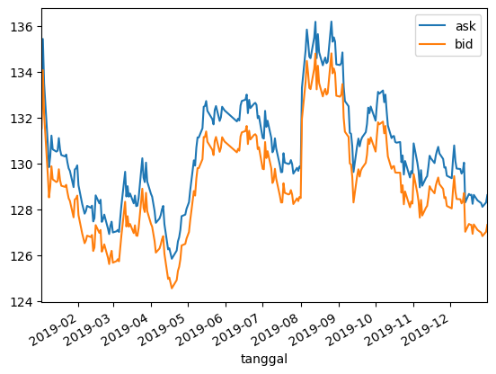

This project is about scraping of a website of a local brokerage firm in Indonesia. Information is related to IDR vs JPY of 2019

Movement of IDR vs JPY fluctuated in a relatively volatile manner in the range of 10 - 15 bps throughout 2019 due to internal and external factors such as:
1. General presidential election
2. Large demonstration of students rejecting bills related to Corruption Eradication Committee
3. Volatility in world's market due to ongoing trade war

BeautifulSoup is main framework (please check requirements.txt) for the project

Result is then shown on HTML page using Flask

Thank you
